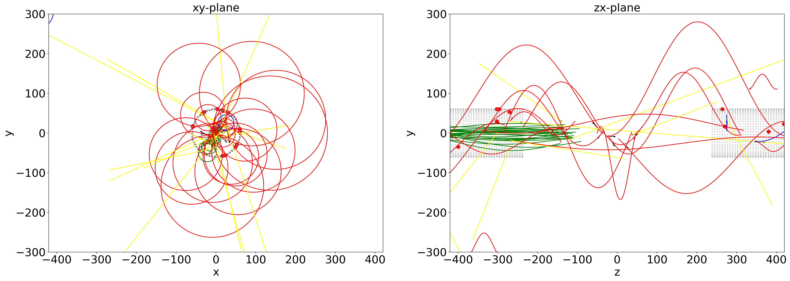
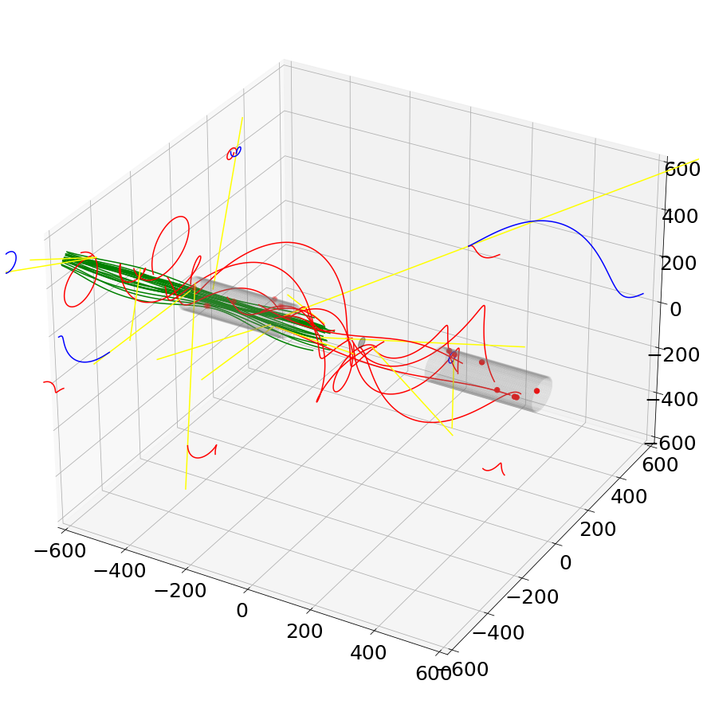

[](https://github.com/maximilianKoeper/melp/actions/workflows/codeql-analysis.yml)

# Mu3eHelper for tile analysis (for python) aka melp  
___
# MELP V2
- TAFT - Time alignment for tiles
- CLUMP - Clustering MELP
- VIS - Visualizer for single Tracks (+ ToyEventGenerator)
___

## Visualizer and ToyEventGenerator

### [-> Readme for Visualizer and ToyEventGenerator](./melp/vis/Readme.md)




___

## TAFT - Time alignment for tiles

[Readme for TAFT](./melp/taft/Readme.md)


___

## CLUMP - Clustering

[Readme for CLUMP](./melp/clustering/Readme.md)

___


## Example:
### more examples are in the jupyter notebooks

- import
```
import matplotlib.pyplot as plt
from melp import Detector
import melp
import melp.taft as taft
```

- initialize Detector
```
mu3e_detector = Detector.initFromROOT("run.root")
```

- time alignment
```
taft.selct(mu3e_detector)

options_cal = {
    "debug_station": 2,     # 1 / 2
    "tof": "simple",  # advanced_new / advanced_graf / simple / None
    "dt_mode": "median",    # MEDIAN / mean / gaus
    "overwrite": True,      # True / False
    "hist_file": 'merged.root',  
        
    "cosmic_correction": False,
    "cosmic_mc_primary": True,
    "cosmic_n_modes" : 5,  # (x2 for cos and sin)
    "ttree_loc": "alignment/mu3e",
    "cosmic_threshold": 0.05,  #m
    "cosmic_file": 'mu3e_sorted_000002_cosmic.root
}

taft.calibrate(**options_cal)
```

- other
```
melp.select(mu3e_detector)
melp.info()

melp.addTileHits("run.root", truth=True, traj=True)
melp.addSensorHits("sorted_truth.root", traj=True)

mu3e_detector.info()
mu3e_detector.save("detector_savefile")

hitangle = melp.getHitAngle(rec_type="Helix")
```

```
import numpy as np

binned_data, xedges, yedges = np.histogram2d(hitangle[0], hitangle[1], bins=[220, 180])

fig = plt.figure(figsize=(10, 8))
import matplotlib as mpl
ax = fig.add_subplot(111, title='theta distribution')
X, Y = np.meshgrid(xedges, yedges)
im = ax.pcolormesh(X, Y, binned_data.T, cmap="turbo", norm = mpl.colors.LogNorm())
plt.ylabel("theta")
plt.xlabel("z")
plt.colorbar(im)
plt.show()
```
